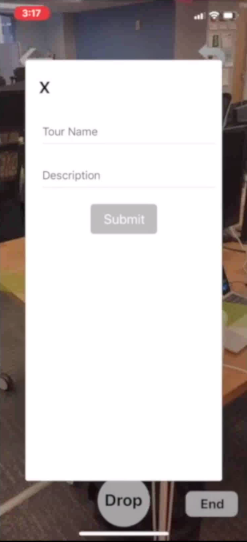
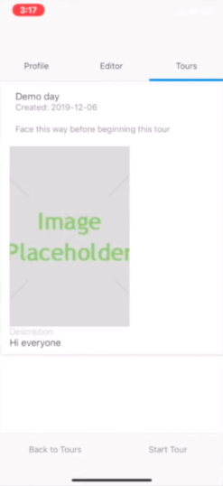

# Yellow Brick Road

## An AR app for creating and experiencing tours in AR.

### MVP Goals:

- Create an app which provides guided tours/directions in AR
- Allow users to create their own tours and directions in AR for others to use and experience

### Stretch Goals

- Support for uploading images when a user finishes making a tour

   

- wall detection to hide tours behind real world objects
- searchable and categorized tours
- favoriting/liking/saving tours
- adding editor features
  - Adding info points along tours as well as AR ojects/images within tours

### Tech Stack

- React Native
  - Used for mobile app development
- ViroAR
  - AR JS Library useful for development of AR apps
- Native Base
  - UI Library for react native
- Node.js
- Postgres
  - Storing user created tours/directions
